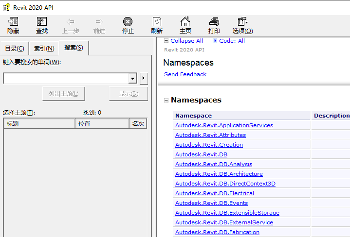

# 开发入门


## markdown语法

用途：文档编写，

### 大纲级别 1级-7级

ctrl+1

。。。。。。

ctrl +7

### 插入代码块

```c#
ctrl + shift +K
```

### 插入链接

CTRL+K

### 编号列表

ctrl+shift +  [

### 无编号列表

ctrl + shift + ]


## C#基础

1. 程序集 Assembly  ,文件扩展名  .dll  .exe

2. 命名空间

3. 类/接口
   - 类的创建

   - 销毁
   
4. 字段/变量

   - 变量类型
     - int float double decimal string  
     - struct  类  （List array )  Document  
   - 属性    ctrl+r  ctrl +e 
   - 
   - 变量访问属性 public private 
   
5. 方法/函数

6. 程序基本结构

   - 顺序

   - 分支

     - if else
   
     - ```clike
                   while (j < personlist.Count)
                   {
                       Person p = personlist[j];
         
                       if (j > 5)
                       {
                           Console.WriteLine(p.Name + "   " + p.Age);
                       }
                       else
                       {
                           Console.WriteLine("索引小于等于5");
                       }
                       j++; // i+=1; i=i+1;
                   }
         
       ```
   
       
   
     - switch case
   
     - ```clike
        int k = 0;
                   switch (k)
                   {
                       case 1: Console.WriteLine("1"); break;
         
                       case 2: Console.WriteLine("2"); break;
         
                       case 3: Console.WriteLine("3"); break;
         
                       case 4: Console.WriteLine("4"); break;
                           
                       default:
                          Console.WriteLine("else"); break;
                   }
   
     
   
   - 循环
   
     - for
   
     - ```clike
       List<Person> personlist = new List<Person>();
       
                   for (int i = 0; i < 10; i++)
                   {
                       Person p1 = new Person("name" + i.ToString(), 20 + i);
                       personlist.Add(p1);
                   }
       
                   Console.WriteLine("person number :" + personlist.Count.ToString());
       
       ```
   
       
   
     - foreach
   
     - ```clike
       foreach (Person p in personlist)
       {
           Console.WriteLine(p.Name + "   " + p.Age);
           Console.WriteLine(Environment.NewLine);
       }
       
       ```
   
       
   
     - while
   
     - ```c#
        int j = 0;
                   while (j<personlist.Count)
                   {
                       Person p = personlist[j];
         
                       Console.WriteLine(p.Name + "   " + p.Age);
                       Console.WriteLine(Environment.NewLine);
         
                       j++; // i+=1; i=i+1;
                   }
       ```
   
     - while +计数器
   
     - ```c#
                   var pipe = default(Pipe);
         
                   var pipeconnectors = pipe.ConnectorManager.Connectors;
         
                   var iterator = pipeconnectors.ForwardIterator();
         
                   while (iterator.MoveNext())
                   {
                       var currEle = iterator.Current as Connector;
                       TaskDialog.Show("revit", currEle.Id.ToString());
                   }
         
       ```
   
       
   

### 函数重载/方法重载

同名函数  参数不同，通过参数的类型数量程序自动判断执行的是哪个函数。

## Revit调试准备


### Revit开发各版本对应.net

Revit 2017: .NET Framework 4.5.2

Revit 2018: .NET Framework 4.6

Revit 2019: .NET Framework 4.7

Revit 2020: .NET Framework 4.7.2

Revit 2021: .NET Framework 4.8

Revit 2022: .NET Framework 4.8


### 安装AddinManager和Lookup

AddInManager.dll

Autodesk.AddInManager.addin

复制到

C:\ProgramData\Autodesk\Revit\Addins\2018


### 使用Lookup和 AddinManager


## Revit帮助文档 RevitApi.chm使用方法

- 帮助文档

  <left>
      <a href="Revit Api帮助文档\20\RevitAPI.chm">revitApi2020.chm</a>
  </left>

- 使用

1. 获取

   通常帮助文档都在Revit SDK开发包里面

2. 查询

   在搜索框内输入关键字，回车即可显示素有相关类和字段

   <left>
       
   </left>


## 第一个Revit程序  HelloWorld!


1. 创建类库项目
2. 引用revit 相关程序集 RevitApi.dll ，RevitApiUI.dll等
3. 继承接口 IExternalCommand
4. 实现接口
5. 编写主程序
6. 调试

   1. 使用Addinmanager调试
   2. 通过addin文件添加来

```c#
namespace RevitFirstApp
{
    [Transaction(TransactionMode.Manual)]
    //
    [Journaling(JournalingMode.UsingCommandData)]
    [Regeneration(RegenerationOption.Manual)]
    public class ShowDialog : IExternalCommand
    {
        public Result Execute(ExternalCommandData commandData, ref string message, ElementSet elements)
        {

            var uiapp = commandData.Application;
            var uidoc = uiapp.ActiveUIDocument;
            var app = uiapp.Application;
            var doc = uidoc.Document;

            var acview = uidoc.ActiveView;

            Selection sel = uidoc.Selection;


            var eleref = sel.PickObject(ObjectType.Element);

            var element = doc.GetElement(eleref.ElementId);

            TaskDialog.Show("元素名称", element.Name);

			//显示高度参数值
            var paras = element.Parameters;

            var iterator = paras.ForwardIterator();

            while (iterator.MoveNext())
            {
                var currentPara = iterator.Current as Parameter;

                if (currentPara.Definition.Name =="高度")
                {
                    MessageBox.Show(currentPara.AsValueString());

                }
            }


            return Result.Succeeded;
        }
    }
}

```


## SDK案例使用方法

- 位置：在Autodesk官方提供的SDK包中


## github用法


https://binbinstrong.github.io/RevitDp_Learn


# 知识点

### 查询类定义

 ctrl+ 鼠标左键点击 类名称

### 打开解决方案资源管理器窗口

ctrl + alt + L

### 修改目标框架

properties--》目标框架


### 引用dll的属性修改

右键 --》属性


### 字体修改

<left>
    <a href="revit开发入门/assets/MONACO.TTF">monaco字体</a>
</left>


盲打

VS快捷键  操作技巧

